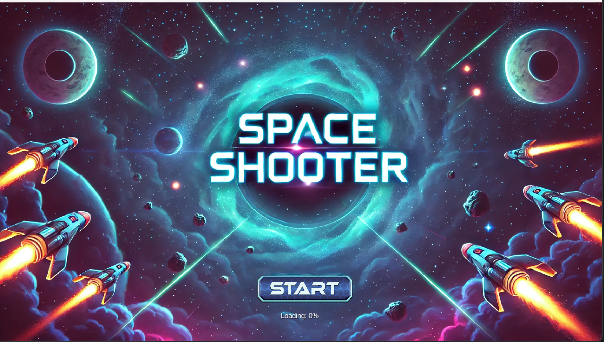
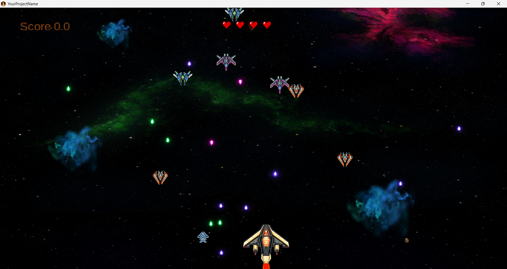

# 🚀 SpaceShutter

A 2D space shooter game made with **Java** and **LibGDX**. Blast through waves of enemy ships, dodge asteroids, and collect power-ups in a fast-paced arcade adventure.


---

## 🎮 Features

- 🔫 Classic space shooter mechanics
- 🛸 Enemy waves with increasing difficulty
- 🌌 Parallax scrolling backgrounds
- 🔊 Sound effects & background music
- 💥 Power-ups and score tracking
- 🎨 Pixel-art style graphics
- 🖥️ Runs on desktop (Windows/Linux/Mac)

---

## 📦 Built With

- [Java](https://www.oracle.com/java/)
- [LibGDX](https://libgdx.com/)
- [Gradle](https://gradle.org/)

---

## 🚀 Getting Started

### 📋 Requirements

- Java JDK 11 or newer
- Gradle (optional – uses Gradle wrapper)
- Git

### 🛠️ Installation

Clone the repository and run the game:

```bash
git clone https://github.com/yourusername/SpaceShutter.git
cd SpaceShutter
./gradlew desktop:run
```

Or import the project into your favorite Java IDE (like IntelliJ IDEA or Eclipse) and run `DesktopLauncher.java`.

---

## 🎯 How to Play

- **Move:** Arrow keys or WASD
- **Shoot:** Spacebar
- **Pause:** P
- **Quit:** Esc
- 💡 **Objective:** Survive waves and defeat as many enemies as possible!

---

## 🗂️ Project Structure

```
SpaceShutter/
├── android/         # Android launcher (optional)
├── core/            # Main game logic and shared code
├── desktop/         # Desktop launcher
├── assets/          # Game assets (sprites, music, sounds)
├── screenshots/     # Screenshots for README/demo
├── build.gradle     # Gradle configuration
└── README.md
```

---

## 📸 Screenshots

| Gameplay                           | Main Menu                      |
|------------------------------------|--------------------------------|
|  |  |

---

## 📈 Roadmap

- [x] Player movement & shooting
- [x] Enemy waves
- [x] Power-ups and scoring system
- [ ] Boss battles
- [ ] Online leaderboard
- [ ] Mobile (Android) support

---

## 🤝 Contributing

Found a bug or want to add something cool?  
Fork the repo, make your changes, and open a pull request. Contributions welcome!

---

## 📃 License

This project is licensed under the **MIT License**.  
See the [LICENSE](LICENSE) file for more info.

---

## 🙋‍♂️ Author

**[Mehedi Hasan Maruf](https://github.com/maruf6890)**  
Feel free to reach out or follow me for more projects!
